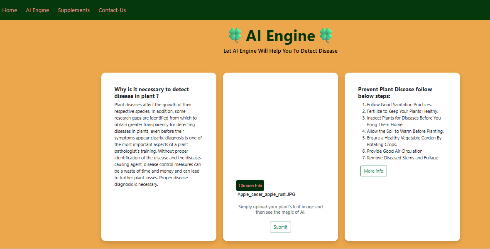
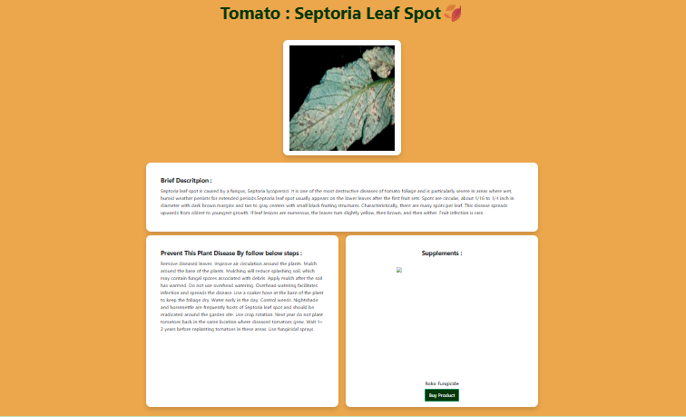

# ⭐Plant-Disease-Detection
* Plant Disease is necessary for every farmer so we are created Plant disease detection using Deep learning. In which we are using convolutional Neural Network for classifying Leaf images into 39 Different Categories. The Convolutional Neural Code build in Pytorch Framework. For Training we are using Plant village dataset. Dataset Link is in My Blog Section.

## ⭐Run Project in your Machine
* You must have **Python3.8** installed in your machine.
* Create a Python Virtual Environment & Activate Virtual Environment [Link](https://docs.python.org/3/tutorial/venv.html)
* Install all the dependencies using below command
    `pip install -r requirements.txt`
* Go to the `Flask Deployed App` folder.
* Download the pre-trained model file `plant_disease_model_1.pt` from [here](https://drive.google.com/drive/folders/1ewJWAiduGuld_9oGSrTuLumg9y62qS6A?usp=share_link)
* Add the downloaded file in `Flask Deployed App` folder.
* Run the Flask app using below command `python3 app.py`
* You can also use downloaded file in `Model` Section and play with it using Jupyter Notebook.

## ⭐Contribution ( Open Source )
* This Project is now open source.
* All the developers who are intrested they can contribute in this project.
* Yo can make UI better , make Deep learning model more powerful , add informative markdown file in section...
* If you will change Deep learning make sure you upload updated markdown file (.md) , .pdf and .ipynb in particular section.
* Make sure your code is working. It will not have any type or error.
* You have to fork this project then make a pull request after you testing will successful.
* How to make pull request : https://opensource.com/article/19/7/create-pull-request-github

---

## 🚀 Future Scope

While the current system successfully classifies leaf images into 39 different categories, there are several exciting avenues for future development:

* **Mobile App Integration:** Develop dedicated Android and iOS applications using Flutter or React Native to allow farmers to scan leaves directly via their smartphone cameras in real time.
* **Edge AI Deployment:** Optimize the PyTorch model using quantization or ONNX runtime to run efficiently on low-resource edge devices (e.g., Raspberry Pi or specialized drone hardware) without requiring an internet connection.
* **Smart Treatment Recommendations:** Integrate an automated recommendation engine (potentially leveraging LLMs) to suggest precise organic or chemical remedies, optimal fertilizer usage, and local shop links right after diagnosis.
* **Drone-Based Field Monitoring:** Scale the system to accept aerial imagery from drones for macro-level crop health assessment across multi-acre farms.

---

## ⭐Testing Images

* If you do not have leaf images then you can use test images located in test_images folder
* Each image has its corresponding disease name, so you can verify whether the model is working perfectly or not

## ⭐Blog Link
<a href="https://medium.com/analytics-vidhya/plant-disease-detection-using-convolutional-neural-networks-and-pytorch-87c00c54c88f" target = "_blank">Plant Disease Detection Using Convolutional Neural Networks with PyTorch</a> 

## ⭐Deployed App
<a href="https://plant-disease-detection-ai.herokuapp.com/" target = "_blank">Plant-Disease-Detection-AI</a> 

## ⭐Snippet of Web App :
#### Main page
  
#### AI Engine 
  
#### Results Page 
  
#### Supplements/Fertilizer  Store
  
#### Contact Us 
   
Here is an updated and expanded structure for your project description, featuring well-organized sections for future scope, conclusions, project files, and contact information.

## 📂 Project Files & Directory Structure

Here is a breakdown of the primary directories and files within this repository:

| Directory/File | Description |
| --- | --- |
| **`.github/workflows/`** | Contains CI/CD configuration files for automated testing and deployment pipelines. |
| **`Flask Deployed App/`** | The core web application directory containing `app.py`, HTML templates, and static assets. |
| **`Model/`** | Includes the Jupyter Notebooks (`.ipynb`) used for training, evaluating, and exporting the CNN model. |
| **`demo_images/`** | Sample images showcasing the web interface and successfully predicted leaf diseases. |
| **`test_images/`** | A collection of labeled leaf images that users can use to verify the model's accuracy. |
| **`README.md`** | Main documentation file providing an overview, setup steps, and contribution guidelines. |

---
---

## 💳 Credits & Acknowledgements

* **Original Repository:** Based on / adapted from [Original Repo Name](https://github.com/username/repository-name) by [@username](https://github.com/username)
* **Dataset:** [PlantVillage Dataset](https://www.kaggle.com/datasets/emmarex/plantdisease)
* **Reference Guide:** [Plant Disease Detection Using CNN with PyTorch](https://medium.com/@manthan89-py/plant-disease-detection-using-convolutional-neural-networks-with-pytorch-24f79471f008) by `@manthan89-py`

---

## 📝 Conclusion

The **Plant Disease Detection AI** demonstrates the powerful capability of Deep Learning and Convolutional Neural Networks (CNN) in modern agriculture. By training on the comprehensive PlantVillage dataset with PyTorch, the model achieves robust classification performance across 39 distinct categories. Deploying this model via a user-friendly Flask web interface effectively bridges the gap between complex AI research and practical, on-the-ground utility for farmers, ultimately helping to minimize crop loss and improve yield predictability.

---

## 📬 Contact Information

We welcome questions, feedback, and collaboration opportunities! Feel free to reach out through any of the channels below:

* **Developer Name:** Poornashree J P
* **Project Maintainer:** [StudentCoderr](https://github.com/StudentCoderr)
* **Repository Link:** [GitHub - AIML-Mini-prj](https://github.com/StudentCoderr/AIML-Mini-prj)
* **Issue Tracker:** For bugs, feature requests, or technical questions, please open a formal issue on our [GitHub Issues Page](https://github.com/StudentCoderr/AIML-Mini-prj/issues).
* **Developer Email:** ammupoorna14@gmail.com
